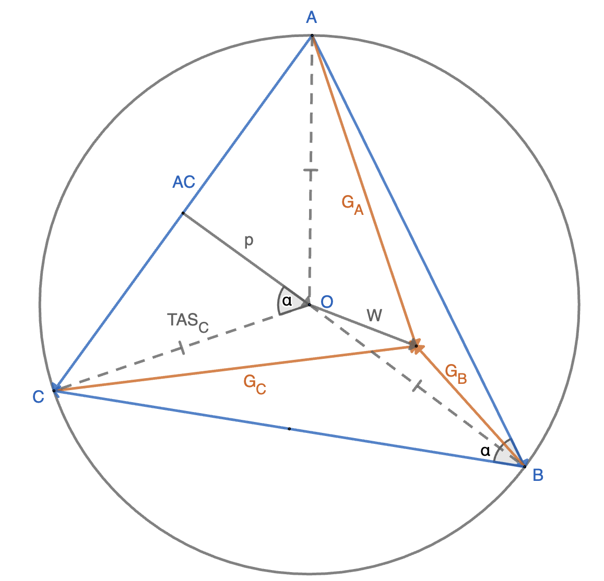

# TAS
Doug Gray presented a fantastic method for measuring true airpseed vectors (airspeed and heading) from GPS vectors (groundspeed and ground track).

Although his spreadsheet formulas work, I wanted to understand it more deeply and write some code. I re-learned some trig and geometry so I could re-derive what is going on here.

## References
- [Using GPS to accurately establish True Airspeed (TAS)](https://www.kilohotel.com/rv8/rvlinks/doug_gray/TAS_FNL4.pdf), Doug Gray, 1998
- [Flight Testing: Finding TAS from GPS Data](https://www.kitplanes.com/flight-testing-finding-tas-from-gps-data/), Kevin Horton, 2009
